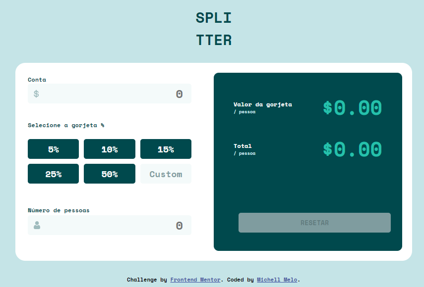

Solução de aplicativo de calculadora de gorjetas

Esta é uma solução para o [desafio do aplicativo de calculadora de gorjeta do Frontend Mentor](https://www.frontendmentor.io/challenges/tip-calculator-app-ugJNGbJUX). Os desafios do Frontend Mentor ajudam você a melhorar suas habilidades de codificação criando projetos realistas.

## Índice

- [Visão geral](#visãogeral)
  - [O desafio](#the-challenge)
  - [Captura de tela](#capturadetela)
- [Meu processo](#meu-processo)
  - [Construído com](#construídocom)
  - [O que aprendi](#o-que-aprendi)
- [Autor](#autor)
- [Agradecimentos](#agradecimentos)

## Visão geral

### O desafio

Os usuários devem ser capazes de:

- Visualizar o layout ideal para o aplicativo, dependendo do tamanho da tela do dispositivo
- Calcular a gorjeta correta e o custo total da conta por pessoa

### Captura de tela




## Meu processo

### Construído com

- Marcação HTML5
- Propriedades personalizadas de CSS
- Flexbox
- Grid
- JavaScript
- Manipulação do DOM

### O que eu aprendi

- Usar variáveis CSS

``` css
.root {
  --bg-color: #c5e4e7;
  --primary-color: #00494d;
  --input-color: #7f9c9f;
  --other-color: #5e7a7d;
  --select-color: #26c0ab;
  --number-color: #f4fafa;
  --white-color: #ffffff;
  --error-color: #ff0043;
}
```

## Autor

- Linkendin - [Michell Melo](https://www.linkedin.com/in/michell-melo-23a6301a8)


## Agradecimentos

Meus agradecimentos é direcionado à equipe do curso de Programador Fullstack JavaScript da [OneBitCode](https://programador.onebitcode.com/), que ensinam realmente a programar. Consegui realizar este desafio por meio do que aprendi no curso.


